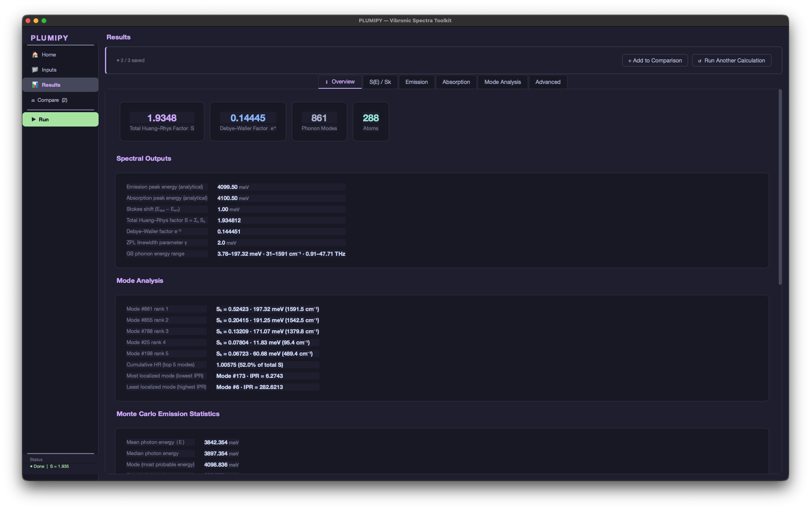

# PLUMIPY

**Photoluminescence and absorption spectra from first-principles.**

PLUMIPY implements the Huang–Rhys formalism and its extensions to compute vibronic optical spectra of defects and molecules from DFT outputs. It ships both a **desktop GUI** and a **Python API** for scripting and HPC workflows.

---

## Features

- Photoluminescence (emission) and absorption spectra
- Standard Huang–Rhys theory with generating function approach
- Monte Carlo sampling for emission — numerically stable at any HR factor
- Displaced–squeezed oscillator model (accounts for GS/ES frequency changes)
- Temperature-dependent spectra (Bose–Einstein occupation)
- Mode-resolved Huang–Rhys factors S<sub>k</sub>, total HR factor, Debye–Waller factor
- Inverse participation ratio (IPR) per mode
- **Normal mode vector viewer** — interactive WebGL 3D renderer of phonon displacement vectors on the crystal structure, with CPK-coloured atoms, bonds, and VESTA export; no internet required
- **Restoring Force tab** — dual lollipop charts of the mode-resolved restoring force F<sub>k</sub> = −ω<sub>k</sub>²·q<sub>k</sub> and mode displacement q<sub>k</sub> vs phonon energy, with hover tooltips
- **Energy Distribution sub-tab** — Γ-point phonon energy level diagram and Gaussian-broadened mode density side by side
- **Displacement Viewer tab** — WebGL visualisation of (a) GS/ES/ΔF force vectors on the crystal (Vertical Gradient workflow) and (b) geometry displacement ΔR = R<sub>ES</sub> − R<sub>GS</sub> (Adiabatic Approximation workflow), both with scale/threshold controls and VESTA export
- Three workflows:
  - **Adiabatic** (structure-based): ΔR projected onto phonon modes
  - **Vertical gradient** (force-based): ΔF projected onto phonon modes
  - **External vibrational data**: frequencies + modes from any code
- Integrates with VASP (CONTCAR, OUTCAR), Phonopy (band.yaml), Gaussian, ORCA, CP2K, QE, …
- HDF5 export of all computed quantities
- Interactive comparison of up to 3 calculations side-by-side

---

## Platform Support

| Platform | GUI (`plumipy-gui`) | Python API | Notes |
|---|---|---|---|
| macOS 12+ | ✓ | ✓ | Tested on Apple Silicon and Intel |
| Windows 10/11 | ✓ | ✓ | pip creates `plumipy-gui.exe` in `Scripts\` automatically |
| Linux (desktop) | ✓ | ✓ | Requires X11 or Wayland display server |
| Linux HPC / headless | ✗ | ✓ | No display needed; use the Python API and save results to HDF5 |

---

## Installation

Requires Python ≥ 3.10.

```bash
git clone https://github.com/m-singhal/plumipy.git
cd plumipy
python -m venv plumipy-env
source plumipy-env/bin/activate   # macOS / Linux
# plumipy-env\Scripts\activate   # Windows
pip install -e .
```

---

## Desktop GUI

Requires a graphical display (macOS, Windows, or Linux desktop). Launch with:

```bash
plumipy-gui
```

> **HPC / headless servers** — use the Python API directly (see below). The GUI is not needed for computation; all physics is accessible via `calculate_spectra_analytical()`, and results are saved to HDF5 for later inspection.

The GUI walks you through a four-step wizard:

1. **Workflow** — choose Adiabatic, Vertical Gradient, or External Vibrational Data
2. **Input Files** — browse for structures, forces, phonon files, or NumPy arrays
3. **Parameters** — ZPL, broadening (σ, γ), temperature, mode subtraction
4. **Advanced** — Monte Carlo, squeezed oscillator, HDF5 export, experimental overlay

Results are displayed in tabbed panels (Overview, S(E)/S<sub>k</sub>, Emission, Absorption, Mode Analysis, Restoring Force, Displacement Viewer, Advanced). Up to 3 calculations can be saved and compared side-by-side.

The **Mode Analysis** tab contains three sub-tabs:

- **Sk and IPR** — interactive scatter plot of S<sub>k</sub> vs phonon energy; bubble size scales with S<sub>k</sub>, colour encodes IPR; hover tooltips report mode index, frequency, S<sub>k</sub>, and IPR.
- **Energy Distribution** — left panel shows a Γ-point phonon energy level diagram (horizontal lines at each E<sub>k</sub>); right panel shows the Gaussian-broadened mode density (KDE), giving an at-a-glance view of which energy regions are most densely populated.
- **Normal Mode Vectors** — embedded WebGL viewer that renders the phonon displacement vectors of any selected mode directly on the crystal structure. Features CPK-coloured atoms, covalent bonds, unit-cell wireframe, red displacement arrows, and an element legend. Controls: mode index, arrow scale (auto-set so the largest displacement ≈ 2 Å), displacement threshold. For Vertical Gradient calculations (no structure in results) an optional structure file picker is shown. Optional **Save .vesta** exports a VESTA file with CELLP, STRUC, BOUND, SBOND (bond cutoffs from covalent radii), SITET, VECTR, and VECTT — open directly in VESTA to inspect and render.

The **Restoring Force** tab shows two stacked lollipop charts:

- **F<sub>k</sub> vs E<sub>k</sub>** — mode-resolved restoring force F<sub>k</sub> = −ω<sub>k</sub>²·q<sub>k</sub> in meV·(√amu·Å)⁻¹; blue stems for F<sub>k</sub> > 0, red for F<sub>k</sub> < 0.
- **q<sub>k</sub> vs E<sub>k</sub>** — mode displacement in √amu·Å; same colour convention. Hover tooltips on either chart populate a summary card showing mode index, energy, frequency, F<sub>k</sub>, and q<sub>k</sub>.

The **Displacement Viewer** tab contains two sub-tabs, both using the same WebGL renderer:

- **Force Vectors** (Vertical Gradient workflow) — renders GS forces, ES forces, or ΔF = F<sub>ES</sub> − F<sub>GS</sub> as arrows on a user-supplied structure. Controls: force selection, arrow scale, magnitude threshold, Save .vesta.
- **Geometry ΔR** (Adiabatic Approximation workflow) — renders ΔR = R<sub>ES</sub> − R<sub>GS</sub> displacement vectors on the ground-state structure; scale is auto-set so the largest arrow ≈ 2 Å. Requires no additional file input. Save .vesta supported.

### Screenshots


*Compare page — up to 3 calculations plotted side-by-side (emission left, absorption right). Solid = Standard HR, dashed = Monte Carlo, dotted = squeezed oscillator, markers = experiment. Experimental data is aligned in real time using Y-scale and X-shift controls in the sidebar.*

<table>
<tr>
<td width="50%"></td>
<td width="50%"></td>
</tr>
<tr>
<td><em>Overview — total Huang–Rhys factor S, Debye–Waller factor e<sup>−S</sup>, phonon mode count, top-ranked modes by S<sub>k</sub>, and Monte Carlo emission statistics all in one panel.</em></td>
<td><em>Emission tab — analytical lineshape (generating function), Monte Carlo histogram, and scaled experimental overlay. Interactive tooltips report photon energy and intensity at any point.</em></td>
</tr>
<tr>
<td width="50%"></td>
<td width="50%"></td>
</tr>
<tr>
<td><em>Mode Analysis → Sk and IPR — interactive S<sub>k</sub> vs phonon energy scatter plot. Bubble size scales with S<sub>k</sub>; colour encodes the inverse participation ratio (IPR). Hover over any mode to see its index, frequency, S<sub>k</sub>, and IPR.</em></td>
<td><em>Advanced → Squeezed Oscillator — mode-resolved squeezing parameters r<sub>k</sub> = ½ ln(ω<sub>ES,k</sub>/ω<sub>GS,k</sub>) and the resulting frequency-corrected emission and absorption spectral functions and lineshapes.</em></td>
</tr>
</table>


*Advanced → Overlay — Standard HR (top row) and displaced–squeezed oscillator (bottom row) shown as spectral function A(E) and lineshape L(E) in a 4-panel view, with experimental emission overlaid and scaled for direct comparison.*


*Mode Analysis → Normal Mode Vectors — embedded WebGL viewer rendering phonon displacement vectors on the crystal structure. Atoms are CPK-coloured, covalent bonds are drawn automatically, and red arrows show the displacement pattern for the selected mode. Controls: mode index (auto-jumps to the highest S<sub>k</sub> mode), arrow scale (auto-set so the largest displacement ≈ 2 Å), and displacement threshold. Supports rotation (left drag), pan (right drag), and zoom (scroll). Export to VESTA via Save .vesta for further visualisation.*

---

## Python API

```python
from plumipy import calculate_spectra_analytical

results = calculate_spectra_analytical(
    structure_gs         = "CONTCAR_gs",   # POSCAR/CONTCAR, .npy, .txt, …
    structure_es         = "CONTCAR_es",
    phonons_gs           = "OUTCAR",       # VASP OUTCAR or Phonopy band.yaml
    qk_calculation_type  = "r",            # "r" = adiabatic, "f" = vertical gradient
    zpl                  = 1200.0,         # meV
    sigma_init           = 3.0,            # meV
    sigma_final          = 3.0,            # meV
    gamma                = 2.0,            # meV
    monte_carlo_emission = True,
    save_to_hdf5         = True,
)

HR  = results["HR"]
Sk  = results["Sk"]
Ek  = results["Ek_gs"]

std = results["standard_hr"]
E_em, I_em  = std["E_photon_emission"],   std["I_emission"]
E_abs, I_abs = std["E_photon_absorption"], std["I_absorption"]
```

For the full parameter reference:

```python
from plumipy import calculate_spectra_analytical
help(calculate_spectra_analytical)
```

or see [`plumipy/api.py`](plumipy/api.py).

---

## HPC & Scripted Workflows

The Python API runs on any platform with Python ≥ 3.10 — no display or GUI is required. This makes it suitable for batch jobs on HPC clusters.

### Install on a cluster

```bash
module load python/3.11           # adjust to your cluster's module name
python -m venv ~/plumipy-env
source ~/plumipy-env/bin/activate
pip install git+https://github.com/m-singhal/plumipy.git
```

Or, if you have the repository checked out:

```bash
pip install /path/to/plumipy
```

### Write a run script

Create `run_plumipy.py`:

```python
from plumipy import calculate_spectra_analytical

results = calculate_spectra_analytical(
    structure_gs        = "CONTCAR_gs",   # POSCAR/CONTCAR, .npy, or .txt
    structure_es        = "CONTCAR_es",
    phonons_gs          = "OUTCAR",       # VASP OUTCAR or Phonopy band.yaml
    qk_calculation_type = "r",           # "r" = adiabatic, "f" = vertical gradient
    zpl                 = 1200.0,        # meV
    sigma_init          = 3.0,           # meV
    sigma_final         = 3.0,           # meV
    gamma               = 2.0,           # meV
    temperature         = 300.0,         # K
    monte_carlo_emission= True,
    save_to_hdf5        = True,          # writes spectra_output.h5
)

print(f"Huang–Rhys factor S  : {results['HR']:.4f}")
print(f"Mode-resolved Sk     : {results['Sk']}")
```

Run interactively to test:

```bash
python run_plumipy.py
```

### Submit a SLURM job

Create `plumipy_job.sh`:

```bash
#!/bin/bash
#SBATCH --job-name=plumipy
#SBATCH --ntasks=1
#SBATCH --cpus-per-task=4
#SBATCH --mem=8G
#SBATCH --time=01:00:00
#SBATCH --output=plumipy_%j.log

module load python/3.11
source ~/plumipy-env/bin/activate

python run_plumipy.py
```

Submit and monitor:

```bash
sbatch plumipy_job.sh
squeue --me
tail -f plumipy_<jobid>.log
```

### Retrieve and inspect results

Copy the HDF5 file back to your local machine:

```bash
scp user@cluster.uni.edu:/scratch/user/spectra_output.h5 .
```

Then load it locally in Python or open the PLUMIPY desktop GUI (File → Load HDF5). See [Loading HDF5 Results](#loading-hdf5-results) for the Python loader.

---

## Output Structure

All outputs are returned as a Python dictionary. When `save_to_hdf5=True`, the same structure is written to `spectra_output.h5`.

### Core

| Key | Shape | Units |
|---|---|---|
| `hbar` | scalar | √(meV·amu)·Å |

### Geometry

| Key | Shape | Units |
|---|---|---|
| `R_gs` | (N_atoms, 3) | Å |
| `R_es` | (N_atoms, 3) | Å |
| `atoms` | list | — |
| `masses` | (N_atoms,) | amu |

### Forces

| Key | Shape | Units |
|---|---|---|
| `F_gs` | (N_atoms, 3) | eV/Å |
| `F_es` | (N_atoms, 3) | eV/Å |

### Phonons / Vibrations — Ground State

| Key | Shape | Units |
|---|---|---|
| `freqs_gs` | (N_modes,) | THz or cm⁻¹ |
| `modes_gs` | (N_modes, N_atoms, 3) | dimensionless |
| `Ek_gs` | (N_modes,) | meV |
| `wk_gs` | (N_modes,) | √(meV/amu)/Å |
| `IPR_gs` | (N_modes,) | dimensionless |

### Phonons / Vibrations — Excited State

| Key | Shape | Units |
|---|---|---|
| `freqs_es` | (N_modes,) | THz or cm⁻¹ |
| `modes_es` | (N_modes, N_atoms, 3) | dimensionless |
| `Ek_es` | (N_modes,) | meV |
| `wk_es` | (N_modes,) | √(meV/amu)/Å |
| `IPR_es` | (N_modes,) | dimensionless |

> If ES phonons are not provided, GS values are reused (no squeezing).

### Electron–Phonon Coupling

| Key | Shape | Units |
|---|---|---|
| `qk` | (N_modes,) | √(amu)·Å |
| `Sk` | (N_modes,) | dimensionless |
| `HR` | scalar | dimensionless |

### Standard Huang–Rhys Spectra (`results["standard_hr"]`)

```python
std = results["standard_hr"]

std["S_E"]                  # (N_E,)      spectral function [1/meV]
std["E_phonons"]            # (N_E,)      phonon energy grid [meV]
std["G_t"]                  # (N_t,)      generating function
std["t_fs"]                 # (N_t,)      time grid [fs]
std["E_photon_emission"]    # (N_ph,)     [meV]
std["I_emission"]           # (N_ph,)     arbitrary units
std["E_photon_absorption"]  # (N_ph,)     [meV]
std["I_absorption"]         # (N_ph,)     arbitrary units
```

### Monte Carlo Emission (`results["monte_carlo_emission"]`)

```python
mc = results["monte_carlo_emission"]

mc["E_photon_emission"]   # (N_E,)  [meV]
mc["I_emission"]          # (N_E,)  arbitrary units
mc["mean"]                # meV
mc["median"]              # meV
mc["mode"]                # meV
mc["var"]                 # meV²
mc["std"]                 # meV
mc["skewness"]            # dimensionless
mc["kurtosis"]            # excess kurtosis, dimensionless
```

### Displaced–Squeezed Oscillator (`results["squeezed"]`)

Requires `enable_squeezing=True` and separate ES phonons.

```python
sq = results["squeezed"]

sq["rk"]                    # (N_modes,)  squeezing parameters
sq["G_t_emission"]          # (N_t,)
sq["G_t_absorption"]        # (N_t,)
sq["t_fs"]                  # (N_t,)      [fs]
sq["E_photon_emission"]     # (N_ph,)     [meV]
sq["I_emission"]            # (N_ph,)
sq["E_photon_absorption"]   # (N_ph,)     [meV]
sq["I_absorption"]          # (N_ph,)
sq["nk_mean_emission"]      # (N_E,)
sq["nk_mean_absorption"]    # (N_E,)
sq["E_phonons"]             # (N_E,)      [meV]
sq["S_E_emission"]          # (N_E,)      [1/meV]
sq["S_E_absorption"]        # (N_E,)      [1/meV]
```

---

## Loading HDF5 Results

```python
import h5py
import numpy as np

def load_hdf5_results(filename):
    def load_group(group):
        data = {}
        for key in group.keys():
            item = group[key]
            data[key] = load_group(item) if isinstance(item, h5py.Group) else item[()]
        return data
    with h5py.File(filename, "r") as f:
        return load_group(f)

data = load_hdf5_results("spectra_output.h5")

Sk  = data["Sk"]
std = data["standard_hr"]
I_em = std["I_emission"]
```

---

## References

If you use PLUMIPY in your research, please cite the following:

1. Alkauskas, A., Buckley, B. B., Awschalom, D. D. & Van de Walle, C. G. First-principles theory of the luminescence lineshape for the triplet transition in diamond NV centres. *New J. Phys.* **16**, 073026 (2014). https://doi.org/10.1088/1367-2630/16/7/073026
   — Standard Huang–Rhys theory and the generating-function approach for computing vibronic PL lineshapes from first principles.

2. Iwański, J. et al. Revealing polytypism in 2D boron nitride with UV photoluminescence. *npj 2D Mater. Appl.* **8**, 72 (2024). https://doi.org/10.1038/s41699-024-00511-7
   — Multiconfiguration spin-purification method for separating spin-manifold contributions to the PL spectrum.

3. Jin, Y. et al. Photoluminescence spectra of point defects in semiconductors: Validation of first-principles calculations. *Phys. Rev. Mater.* **5**, 084603 (2021). https://doi.org/10.1103/PhysRevMaterials.5.084603
   — Temperature-dependent PL spectra via Bose–Einstein phonon occupation; vertical-gradient (force-based) approach for computing Huang–Rhys factors.

4. *(this work — displaced–squeezed oscillator model)*
   — Extension of the generating function to account for ground- and excited-state frequency differences through mode-resolved squeezing parameters r<sub>k</sub> = ½ ln(ω<sub>ES,k</sub>/ω<sub>GS,k</sub>).

5. *(this work — Monte Carlo emission sampling)*
   — Numerically stable Monte Carlo approach for PL lineshapes at any Huang–Rhys factor, bypassing the generating-function instability in the strong-coupling regime.

### Normal mode vector visualisation

The VESTA export logic in the Normal Mode Vectors viewer is based on the approach pioneered by:

> Roy, A. *Phonopy_VESTA — Export Eigenvectors from Phonopy format to VESTA.* GitHub (2020). https://github.com/AdityaRoy-1996/Phonopy_VESTA

The original script reads `band.yaml` and an existing `POSCAR.vesta` template, injects `VECTR`/`VECTT` blocks for each mode, and saves one `.vesta` file per band. PLUMIPY's implementation extends this by generating the full VESTA file from scratch (CELLP, STRUC, BOUND, SBOND, SITET, VECTR, VECTT, ATOMT) directly from the computed phonon data, without requiring a pre-existing template.

---

## License

MIT — see [LICENSE](LICENSE).
